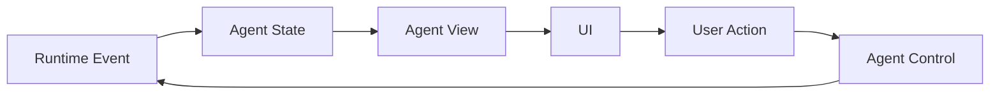

# 《Agent 工程思考：从 ReAct 到 Agent Harness》内容梳理

整理日期：2026-08-19

原始链接：https://zhuanlan.zhihu.com/p/2063573632769582761

可读来源：https://www.cnblogs.com/vivotech/p/21816314

> 说明：知乎原链接访问时返回 403，本文基于可访问的博客园镜像版本进行整理。以下是内容梳理与工程化改写，不是原文转载。

## 1. 一句话概览

文章讨论的是：Agent 产品不能只停留在 ReAct 式的「模型思考、调用工具、观察结果」循环上，还需要一层 Agent Harness，把模型行为沉淀为系统可以恢复、控制、展示、审计和检查的运行事实。

简单说：

- ReAct 解决模型怎么一步步行动。
- Agent Harness 解决这些行动如何成为产品系统里可信、可恢复、可追踪的事实。

## 2. 文章核心观点

### 2.1 Agent 不只是 model + loop

早期 Agent demo 通常可以抽象成一个循环：

```text
reason -> act -> observe -> reason...
```

这个抽象适合说明模型如何推理和调用工具，但进入真实产品后会遇到更多运行时问题：

- 用户刷新页面后，之前的工具审批是否还存在。
- 工具执行到一半时服务重启，下次应该从哪里恢复。
- 子 Agent 在后台执行时，主任务如何展示它的状态。
- 生成的文档、图片、数据等 artifact，如果不直接塞回上下文，它的引用和归属应该放在哪里。
- 用户点击 stop 后，哪些运行要终止，哪些中间状态要保留。

这些问题不是 ReAct 的职责，而是 Agent 工程系统的职责。

### 2.2 ReAct 有明确边界

ReAct 的基本单位是：

```text
Thought -> Action -> Observation
```

它主要描述模型内部的执行微循环。Observation 在 ReAct 中通常是给模型看的工具结果，可以是一段文本。

但在产品系统中，同一次工具调用会被多个消费方使用：

- 前端要知道是否显示审批按钮、加载状态、停止按钮。
- 后端要知道任务卡在哪里，是否能恢复。
- 存储层要知道哪些状态需要持久化。
- artifact 面板要知道某个结果属于哪次运行。

如果 Observation 只是文本，系统就缺少统一事实来源。UI、后端 adapter、消息渲染和临时缓存都会各自推断状态，最后造成一致性问题。

因此，ReAct 解释的是执行循环，Agent Harness 要定义的是事实边界。

### 2.3 Agent Harness 要在运行路径上生产事实

文章强调，Agent Harness 不是给 UI 包一层展示 adapter，而应该位于 runtime 的运行路径上。

关键节点应该由 runtime 直接产生 event 和 state，例如：

- run started
- message created
- tool call created
- tool approval required
- tool call running
- tool call completed
- artifact created
- checkpoint written
- run finished

同理，用户操作也不应该只停留在前端本地状态里，而应该进入 runtime control，例如：

- approve
- reject
- stop
- resume
- reload

判断标准是：同一个运行事实，不应该从多个地方拼出来。比如 pendingApproval、artifactRef、activeRun、canStop 等状态，要么是 runtime state，要么是从 runtime state 派生出的 view。

## 3. 从 Loop 到协议

文章给出的工程分层可以整理成下面这条链路：



这套分层里有三个核心概念。

### 3.1 State 是事实

State 记录 Agent 运行过程中必须被系统承认和引用的事实。它应该由 runtime 和明确的业务边界生产。

常见 state 类型包括：

- messages：对话和运行消息。
- activeRun：当前正在运行的任务。
- checkpoint：可恢复的运行点。
- pendingApproval：等待用户处理的审批。
- todos：任务拆解或待办状态。
- subagents：子 Agent 的运行关系。
- artifactRefs：文档、图片、数据等产物的引用。
- workspaceContext：与工作区相关的上下文。

这些状态会影响任务是否能继续、是否能恢复、用户是否能检查结果，所以不能只存在于前端展示缓存里。

### 3.2 View 是派生

View 是从 state 计算出来的展示层状态，例如：

- isBusy
- canStop
- waitingForFirstToken
- approvalBanner
- toolBadges
- subagentGroups
- messageProjection

举例来说，activeRun 存在时可以派生出 isBusy；pendingApproval 存在时可以派生出审批条；run 已开始但还没有 assistant token 时可以派生出首 token 等待态。

### 3.3 Control 是命令

Control 表达用户或系统对 runtime 发出的命令，例如：

- invoke：发起一次运行。
- resume：从审批或 checkpoint 恢复。
- stop：终止指定 run。
- updateState：提交状态变更。
- reload：重新加载某个 thread 或任务现场。

重要边界是：control 只负责发命令，不顺手修改 UI 展示状态。比如用户点击批准后，前端应该发送 resume，审批条是否消失取决于 runtime 是否继续运行并写回新 state。

## 4. State Schema 是事实边界

文章最关键的工程建议是：开发 Agent 时，应该先设计 State Schema。

如果先设计 prompt、tool 和模型选择，最后才回头补状态，很多重要事实会被迫挂在 message、tool result 或前端缓存上。Agent 一旦进入真实用户工作流，就应该提前回答：

- 哪些事实必须恢复。
- 哪些事实必须跨端一致。
- 哪些事实只是 view。
- 哪些事实代表用户现场。
- 哪些事实可以从 messages 推导。
- 哪些事实必须成为一等状态。

### 4.1 审批应该是可恢复暂停点

审批在 UI 上是一个按钮，但在 runtime 里应该是一个可恢复的暂停点。

如果危险工具调用只触发前端弹窗，用户刷新后弹窗会丢，后端也不知道任务停在哪个 tool call。

更稳妥的做法是把审批写入 state，并关联 run、turn、toolCall、toolName、参数和策略。用户批准或拒绝时，通过 control 把决策发回 runtime，再由 runtime 从 checkpoint 继续。

### 4.2 Artifact 本体可外置，但引用必须进 state

文档、图片、大 JSON、外部系统连接等 artifact 不一定要全部放进 Agent state，可以存储在文件系统、数据库或对象存储中。

但 artifact 的引用、状态和归属应该进入 state。至少需要表达：

- artifact 的唯一标识。
- artifact 类型和标题。
- 当前状态。
- 所属 run。
- 由哪个 tool call 创建。
- 内容实际存放位置或引用。

这样消息列表、右侧面板、历史记录和恢复流程都能通过同一个引用定位产物。

### 4.3 子 Agent 不能只出现在文本里

如果主 Agent 只是输出一段「已启动某个子 Agent」的文本，前端只能从文本里解析 ID。后续要做状态同步、跳转、恢复、错误展示时，这个 ID 没有稳定归属。

因此，子 Agent 的运行关系也应该进入 state，至少包括：

- 子 Agent ID。
- 父 run 和父 turn。
- 标题。
- 状态。
- 开始和结束时间。
- 结果引用。
- 错误信息。

前端再基于这些 state 派生分组、进度、徽标和跳转目标。

## 5. UI 的边界：只能消费事实，不能补写事实

UI 可以负责渲染、布局、交互、流式展示和局部 view state，但 runtime fact 不应该由 UI 自己补出来。

正确方向是：

```text
runtime state -> derived view -> UI rendering
```

不推荐的方向是：

```text
message text -> UI guesses fact -> UI creates local state
```

比如，如果 runtime 没有写入 pendingApproval，UI 不应该仅凭消息文本判断「这句话像审批请求」，然后自己创建审批状态。否则刷新页面、恢复运行、用户批准时的 run 归属都会变得不可靠。

## 6. 可检查的工程验收点

文章把 Harness 的价值落到了几个可验证行为上。整理后可以作为 Agent 产品的验收清单：

- 页面刷新后，等待中的审批仍然存在，并且指向同一个 tool call。
- 进程重启后，可以从 checkpoint 恢复到同一个 run 或 turn。
- 用户 stop 后，activeRun 被正确终止，后端不会继续执行后续 tool call。
- artifactRef 存在时，可以定位内容，并追溯到所属 run 和创建它的 tool call。
- 子 Agent 完成后，父任务可以拿到结果引用，并能展示清晰归属。
- 同一个运行事实只有一个权威来源，前端不需要从文本、工具结果和本地状态里多处拼装。

## 7. 对实际 Agent 系统设计的启发

这篇文章适合用来指导 Agent 产品的架构设计，尤其是下面几类场景：

- 有审批、权限或高风险工具调用的 Agent。
- 需要长时间运行、可暂停、可恢复的 Agent。
- 会生成文档、图片、代码、数据报表等 artifact 的 Agent。
- 支持子任务、子 Agent、后台并发执行的 Agent。
- 需要跨端同步、页面刷新恢复、审计追踪的工作流 Agent。

落地时可以从三件事开始：

1. 先画出 Agent runtime 的 event 流。
2. 再定义必须持久化和恢复的 State Schema。
3. 最后规定 UI 只能从 state 派生 view，用户动作必须通过 control 回到 runtime。

## 8. 总结

ReAct 让 Agent 有了「思考、行动、观察」的执行模式，但它不能单独支撑一个可信的产品系统。

Agent Harness 的核心价值，是把模型行为转化为软件系统中的运行事实。这些事实需要有统一来源、稳定归属、可恢复机制、可控制入口和可检查结果。

对于 Agent 工程来说，真正重要的不是先堆 prompt、tool、MCP、memory，而是先回答：系统如何知道发生过什么，现在卡在哪里，用户能控制什么，以及出问题后能不能回到同一个现场。
