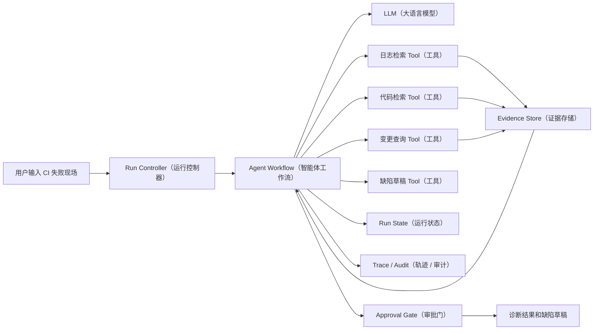

# CI 故障诊断与缺陷草稿 Agent（智能体）项目规格

## 1. 项目定位

这是整条学习路线的主项目，目标是模拟一个测试开发团队日常会使用的 AI Agent（智能体）：

> 输入一次 CI 失败现场，自动收集证据、判断故障类型、生成带证据的根因分析和缺陷草稿，并在高风险动作前等待人工审批。

项目重点不是把所有系统接通，而是展示以下能力：

- Agent（智能体）的工具调用。
- 证据驱动的诊断。
- 明确的状态和 Workflow（工作流）。
- 工具失败和不确定性处理。
- 评测、回归和安全测试。
- 审批、Observability（可观测性）和恢复。

## 2. 用户故事

### 2.1 测试开发工程师

当一条 CI 用例失败时，我希望输入任务链接或失败日志，系统可以：

- 快速判断可能的故障类型。
- 找到相关日志、代码变更和历史缺陷。
- 给出有证据的分析，而不是只给猜测。
- 自动生成缺陷标题、描述、环境和复现信息。
- 在真正创建缺陷前让我确认。

### 2.2 质量负责人

我希望知道：

- Agent（智能体）为什么得出这个结论。
- 它调用过哪些工具。
- 哪些证据支持结论。
- 哪些动作被拒绝或需要人工确认。
- 模型或 Prompt 变化后，准确率是否下降。

## 3. 范围和非范围

### 3.1 第一版范围

- 单 Agent（单智能体）。
- 3 到 5 个工具。
- 本地 Mock（模拟）数据。
- 结构化诊断结果。
- 缺陷草稿，不直接创建真实缺陷。
- 本地 JSON 状态和 Trace（运行轨迹）。
- `pytest` 测试和离线评测。

### 3.2 暂不做

- 多 Agent 协作。
- 自动执行任意 Shell 命令。
- 直接访问生产数据库。
- 自动修改代码。
- 复杂前端。
- 复杂向量数据库。
- 大模型训练或微调。

## 4. 系统架构



推荐的职责分层：

| 层次 | 职责 |
|---|---|
| Run Controller（运行控制器） | 创建、查询、停止、恢复一次运行 |
| Workflow（工作流） | 控制阶段、状态转移和终止条件 |
| LLM Adapter（大模型适配层） | 模型调用、结构化输出和版本记录 |
| Tool Layer（工具层） | 参数校验、权限、执行、错误和结果格式 |
| Evidence Store（证据存储） | 保存证据及其来源 |
| State Store（状态存储） | 保存运行状态和恢复点 |
| Trace Layer（轨迹层） | 保存模型、工具和状态变更轨迹 |
| Evaluation Layer（评测层） | 执行 Golden Case（黄金测试样例）和生成评测报告 |

## 5. Workflow（工作流）

```text
CREATED
  -> CLASSIFYING
  -> COLLECTING_EVIDENCE
  -> DIAGNOSING
  -> DRAFTING_BUG
  -> WAITING_APPROVAL
  -> APPROVED
  -> COMPLETED
```

异常分支：

```text
任意状态 -> FAILED
任意可暂停状态 -> STOPPED
WAITING_APPROVAL -> REJECTED
FAILED -> RETRYABLE 或 TERMINAL
```

### 5.1 阶段说明

| 阶段 | 主要动作 | 允许的工具 |
|---|---|---|
| `CREATED` | 校验输入和创建 Run | 无 |
| `CLASSIFYING` | 判断初步故障类型 | 无或只读 |
| `COLLECTING_EVIDENCE` | 查询日志、代码、变更 | 只读工具 |
| `DIAGNOSING` | 根据证据形成结论 | 只读工具 |
| `DRAFTING_BUG` | 生成缺陷草稿 | 草稿工具 |
| `WAITING_APPROVAL` | 展示动作和证据，等待确认 | 无 |
| `APPROVED` | 模拟或执行写入动作 | 需要审批的工具 |
| `COMPLETED` | 保存结果和统计信息 | 无 |

## 6. 输入和输出 Schema（结构约束）

### 6.1 输入

```json
{
  "run_id": "run-20260914-001",
  "project": "checkout-service",
  "pipeline_id": "ci-12345",
  "failed_test": "test_create_order_with_coupon",
  "failure_log": "AssertionError: expected 200, got 500",
  "stack_trace": "at OrderApiTest.java:88",
  "git_diff": "changed coupon validation logic",
  "environment": {
    "branch": "feature/coupon-rule",
    "commit": "abc123",
    "runtime": "staging"
  }
}
```

### 6.2 诊断结果

```json
{
  "category": "CODE",
  "summary": "优惠券校验变更导致订单接口返回 500",
  "confidence": 0.86,
  "evidence_ids": [
    "log-001",
    "diff-002",
    "code-003"
  ],
  "reasoning_summary": [
    "失败发生在优惠券校验路径",
    "当前提交修改了同一段校验逻辑",
    "日志显示未处理的空值异常"
  ],
  "recommended_action": "CREATE_BUG_DRAFT",
  "needs_human_review": true,
  "uncertainties": []
}
```

要求：

- `evidence_ids` 不能为空，除非 `category` 为 `UNKNOWN` 且明确说明证据不足。
- `confidence` 只能作为辅助信息，不能代替证据。
- `recommended_action` 必须由程序根据风险策略再次校验。
- Agent（智能体）不得直接输出“已创建缺陷”，只能输出草稿或待审批状态。

### 6.3 缺陷草稿

```json
{
  "title": "[CI] 优惠券校验变更导致创建订单返回 500",
  "description": "在 staging 环境执行 test_create_order_with_coupon 时失败。",
  "expected": "创建订单接口返回 200。",
  "actual": "接口返回 500，日志出现未处理的空值异常。",
  "environment": "staging / feature/coupon-rule / abc123",
  "root_cause": "待开发确认：优惠券校验逻辑对空值处理不完整。",
  "evidence_ids": [
    "log-001",
    "diff-002"
  ],
  "severity": "P1",
  "status": "DRAFT"
}
```

## 7. 工具设计

### 7.1 `search_log`

用途：按 Run（运行）、关键词或错误类型检索日志。

输入：

```json
{
  "run_id": "run-20260914-001",
  "query": "NullPointerException",
  "limit": 5
}
```

约束：

- 只能访问当前项目和当前 Run（运行）的日志。
- `limit` 有上限。
- 返回结果必须带来源和时间。
- 查询失败时返回明确错误类型。

### 7.2 `search_code`

用途：查询失败堆栈、文件路径或关键词附近的代码。

约束：

- 只读。
- 只能访问配置允许的代码目录。
- 不执行代码。
- 结果包含文件路径、行号和提交版本。

### 7.3 `get_recent_changes`

用途：查询当前失败版本附近的提交和 Diff（代码差异）。

约束：

- 只读。
- 限制查询时间范围和返回大小。
- 不允许把任意用户输入直接拼成 Shell 命令。

### 7.4 `rerun_test`

用途：重跑单个测试或生成重跑建议。

第一版建议只做 Mock（模拟）：

- 默认返回“需要审批”。
- 不执行真实命令。
- 记录预计执行的测试、分支和环境。
- 通过策略层判断是否允许。

### 7.5 `create_bug_draft`

用途：生成缺陷草稿。

约束：

- 第一版只保存草稿，不直接提交。
- 需要 `approval_token` 或状态为 `APPROVED`。
- 相同 `run_id` 和相同内容不能重复创建。
- 对敏感字段做脱敏。

## 8. State Schema（状态结构）

建议最小状态如下：

```json
{
  "run_id": "run-20260914-001",
  "status": "WAITING_APPROVAL",
  "current_stage": "DRAFTING_BUG",
  "input_ref": "inputs/run-20260914-001.json",
  "classification": {
    "category": "CODE",
    "confidence": 0.86
  },
  "tool_calls": [
    {
      "call_id": "call-001",
      "tool_name": "search_log",
      "status": "COMPLETED",
      "evidence_ids": ["log-001"]
    }
  ],
  "evidence_refs": ["log-001", "diff-002", "code-003"],
  "diagnosis_ref": "diagnosis/run-20260914-001.json",
  "artifact_refs": ["bug-draft/run-20260914-001.json"],
  "pending_approval": {
    "action": "CREATE_BUG",
    "tool_name": "create_bug_draft",
    "reason": "将生成并提交缺陷草稿",
    "expires_at": "2026-09-15T00:00:00Z"
  },
  "checkpoint": "checkpoint-003",
  "error": null
}
```

关键原则：

- `status`、`current_stage` 和 `pending_approval` 是运行事实。
- 前端的 `is_busy`、`can_stop`、`show_approval` 都应该从状态派生。
- Artifact（产物）本体可以存文件，但引用和归属要进入状态。
- 用户批准或拒绝应该通过控制命令改变运行状态。

## 9. 事件和 Trace（运行轨迹）

建议记录以下事件：

```text
run.created
stage.started
model.called
tool.requested
tool.started
tool.completed
evidence.added
diagnosis.created
approval.required
approval.resolved
artifact.created
run.failed
run.completed
```

每个事件至少包含：

```json
{
  "event_id": "event-001",
  "run_id": "run-20260914-001",
  "parent_id": null,
  "event_type": "tool.completed",
  "timestamp": "2026-09-14T10:00:00Z",
  "payload": {},
  "duration_ms": 120,
  "error": null
}
```

## 10. 最小目录结构

```text
ai-agent-project/
├── README.md
├── pyproject.toml
├── app/
│   ├── agent.py
│   ├── models.py
│   ├── workflow.py
│   ├── state.py
│   ├── tools/
│   │   ├── search_log.py
│   │   ├── search_code.py
│   │   ├── recent_changes.py
│   │   └── bug_draft.py
│   ├── storage/
│   │   ├── evidence_store.py
│   │   ├── state_store.py
│   │   └── trace_store.py
│   └── policy.py
├── data/
│   ├── logs/
│   ├── code/
│   ├── diffs/
│   └── cases.jsonl
├── evals/
│   ├── run_eval.py
│   ├── metrics.py
│   └── reports/
├── tests/
│   ├── test_tools.py
│   ├── test_workflow.py
│   ├── test_policy.py
│   └── test_security.py
└── traces/
```

## 11. 验收标准

### P0：两周必须完成

- [ ] 本地可以启动并完成一次端到端运行。
- [ ] 至少有 3 个只读工具。
- [ ] 至少有一个需要审批的动作。
- [ ] 输出包含结构化诊断和证据引用。
- [ ] 有 20 条以上 Golden Case（黄金测试样例）。
- [ ] 有 15 个以上确定性测试。
- [ ] 有至少 5 条安全测试。
- [ ] 能保存一次完整 Trace（运行轨迹）。

### P1：第三周完成

- [ ] 支持从审批点恢复。
- [ ] 支持 Prompt（提示词）或模型版本对比。
- [ ] 统计延迟、Token（令牌）和成本。
- [ ] 接入一个真实或半真实数据源。
- [ ] README 能让别人独立运行项目。

### P2：有余力再做

- [ ] 简单 Web 页面。
- [ ] 真实 CI、Git 或缺陷系统集成。
- [ ] 多租户和权限模型。
- [ ] 子 Agent 或并行检索。
